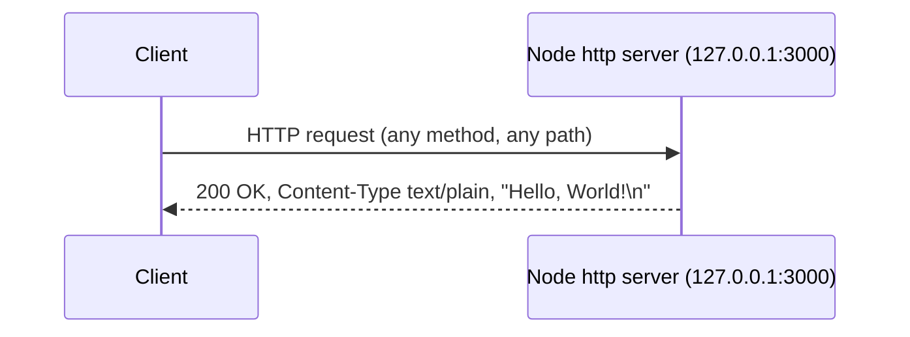

# child_repo_for_submodule_hello_world

A standalone, minimal Node.js standard-library HTTP "Hello, World!" server — byte-identical (in executable code) to the superproject's `server.js`. Source: server.js:L1-L62.

## Table of Contents

1. [Overview](#overview)
2. [Prerequisites](#prerequisites)
3. [Running the Server](#running-the-server)
4. [API Documentation](#api-documentation)
5. [Code Explanation](#code-explanation)
6. [Deployment Guide](#deployment-guide)
7. [Relationship to Superproject](#relationship-to-superproject)
8. [Diagram](#diagram)
9. [Source Citations](#source-citations)

## Overview

This repository is a standalone, dependency-free HTTP server implemented entirely with the Node.js built-in `http` module. Source: server.js:L14.

It binds to the IPv4 loopback interface and responds to **every** request with a fixed `200 OK` plain-text greeting. Source: server.js:L46-L50.

The `server.js` in this repository is **byte-identical (in executable code)** to the superproject's `server.js`; the repository is tracked as a Git submodule and serves as a submodule-materialization validation fixture. Source: server.js:L1-L62.

## Prerequisites

- **Node.js** — any maintained LTS release that supports CommonJS (`require`) and the built-in `http` module. No specific version is pinned: this repository has **no** `package.json` and **no** `.nvmrc`, so do not assume a specific major version is required. Source: server.js:L14.
- **Git** — required to materialize this repository as a submodule of the superproject. Source: .gitmodules.
- **No `npm install`** — there are **zero** third-party dependencies; the only dependency is the Node.js built-in `http` module, so there is nothing to install. Source: server.js:L14.

## Running the Server

From the repository root, start the server directly with the Node.js runtime — `server.js` is a single, self-contained script that needs no build step or dependency installation. Source: server.js:L1-L62.

```bash
node server.js
```

Once it binds successfully, it prints the following confirmation line to stdout:

```text
Server running at http://127.0.0.1:3000/
```

Source: server.js:L61.

## API Documentation

The server exposes a single **catch-all** HTTP responder — there is no routing, no separate endpoints, and no `404` handling. Source: server.js:L46-L50.

| Aspect | Value | Source |
|---|---|---|
| Methods | ALL (any method) | server.js:L46-L50 |
| Paths | ALL (any path) | server.js:L46-L50 |
| Status | `200 OK` | server.js:L47 |
| Content-Type | `text/plain` | server.js:L48 |
| Body | `Hello, World!\n` | server.js:L49 |
| Content-Length | `14` | server.js:L49 |

**Catch-all behavior:** every request — regardless of HTTP method or URL path — converges on the exact same `200 OK` `text/plain` response with the body `Hello, World!\n`. The handler never inspects the request method, URL, headers, or body. Source: server.js:L46-L50.

**Example — `GET /`:**

```bash
curl -i http://127.0.0.1:3000/
```

**Example — non-GET request to an arbitrary path (`POST /anything/else`):**

```bash
curl -i -X POST http://127.0.0.1:3000/anything/else
```

Both commands return the **identical** response shown below, demonstrating the catch-all behavior:

```text
HTTP/1.1 200 OK
Content-Type: text/plain
Content-Length: 14

Hello, World!
```

Source: server.js:L46-L50.

## Code Explanation

A walkthrough of every executable statement in this repository's `server.js`, with physical line numbers that match the current file (verify with `cat -n server.js`). The lines in between are JSDoc comment blocks and blank separators. Source: server.js:L1-L62.

| Line | Statement | Explanation |
|---|---|---|
| `server.js:L14` | `const http = require('http');` | Imports Node's built-in `http` module — the only dependency (no third-party packages). |
| `server.js:L23` | `const hostname = '127.0.0.1';` | Defines the bind address as the IPv4 loopback interface (local-only). |
| `server.js:L32` | `const port = 3000;` | Defines the TCP port the server listens on. |
| `server.js:L46` | `const server = http.createServer((req, res) => {` | Creates the HTTP server and opens the catch-all request handler. |
| `server.js:L47` | `res.statusCode = 200;` | Sets the response status to `200 OK` for every request. |
| `server.js:L48` | `res.setHeader('Content-Type', 'text/plain');` | Sets the response `Content-Type` header to `text/plain`. |
| `server.js:L49` | `res.end('Hello, World!\n');` | Writes the response body `Hello, World!\n` and ends the response. |
| `server.js:L50` | `});` | Closes the request-handler callback. |
| `server.js:L60` | `server.listen(port, hostname, () => {` | Binds the server to `hostname:port` and registers the startup callback. |
| `server.js:L61` | ``console.log(`Server running at http://${hostname}:${port}/`);`` | Logs the startup confirmation line to stdout once the server is bound. |
| `server.js:L62` | `});` | Closes the `server.listen` callback. |

## Deployment Guide

- **Loopback-only.** The server binds to `127.0.0.1`, so it is reachable **only** from the local machine and is **not** exposed to other hosts on the network. Source: server.js:L23.
- **Port-3000 conflict.** This submodule server and the byte-identical superproject server both bind `127.0.0.1:3000`, so they **cannot run concurrently** — starting the second process fails with `EADDRINUSE`. Source: server.js:L23, L32.
- **No build step.** There is nothing to compile or bundle; run the file directly with `node server.js`. Source: server.js:L1-L62.
- **Process management (optional).** To keep the process running unattended, you may launch `node server.js` under any standard OS service manager or process supervisor. This adds no capability to the server itself — the runtime behavior remains the fixed catch-all response. Source: server.js:L46-L50.

## Relationship to Superproject

This repository is tracked as a **Git submodule** of the parent superproject. The superproject pins it at a specific commit recorded by the superproject's **gitlink** — not in `.gitmodules`, which stores only the submodule path and URL. To see the exact pinned commit, run `git submodule status` (or `git ls-tree HEAD child_repo_for_submodule_hello_world`) from the superproject root. The upstream URL is `https://github.com/lakshya-blitzy/child_repo_for_submodule_hello_world.git`, and this repository contains **no** nested submodules (it has no `.gitmodules` of its own). Source: superproject `.gitmodules` (path and URL); superproject gitlink via `git submodule status` (pinned commit).

For superproject-level setup — cloning with `--recurse-submodules`, the materialization workflow, and the overall architecture — see the [superproject README](../README.md). Source: .gitmodules.

## Diagram

The sequence diagram below shows that all methods and all paths converge on one fixed response, served from the loopback bind address `127.0.0.1:3000` shown in the diagram. Source: server.js:L23, L32 (bind address and port), server.js:L46-L50 (catch-all response).



## Source Citations

- `child_repo_for_submodule_hello_world/server.js:L1-L62`
- `.gitmodules` (superproject) — submodule binding metadata: submodule **path** and upstream **URL** only; it does **not** record the pinned commit.
- Superproject **gitlink**, via `git submodule status` / `git ls-tree HEAD child_repo_for_submodule_hello_world` — the **pinned commit** the superproject records for this submodule.
